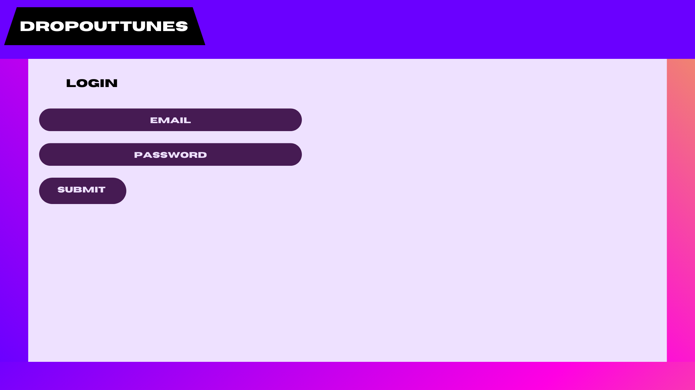
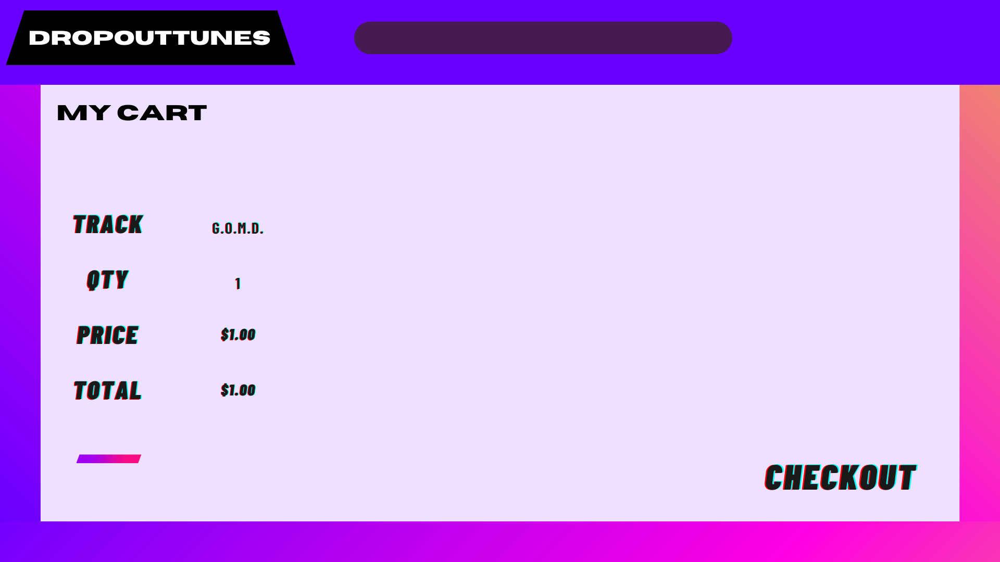
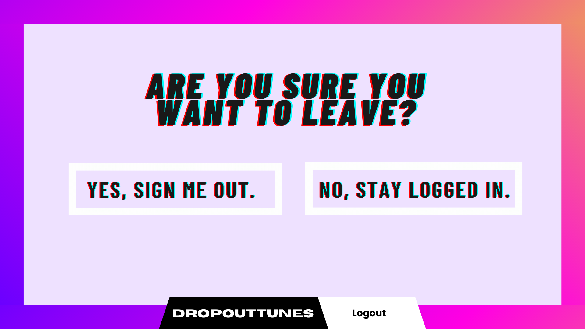
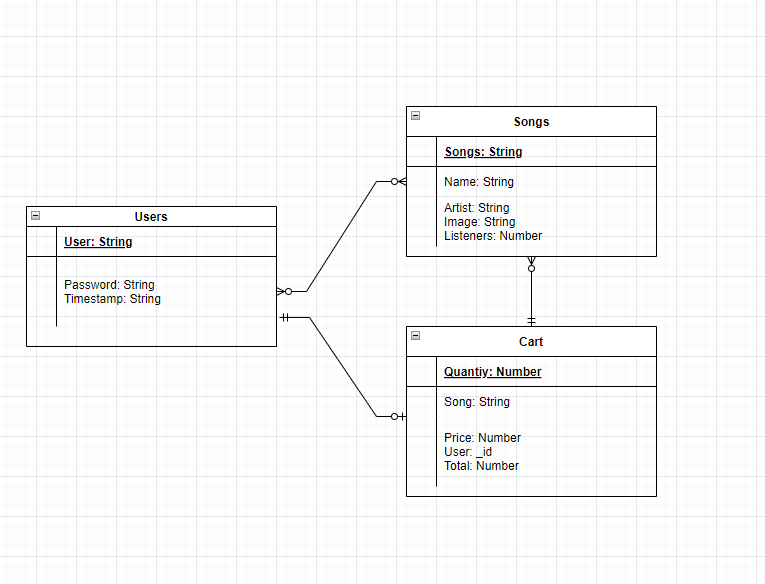

DropoutTunes is a e-commerce website to search and purchase music.
Login and save songs to your cart then checkout.

## FRONT-END

## User Stories
- As a user I can Sign up
- As a user I can Log in
- As a user I can Log out
- As a user I can Change Password
- As a user I can Search Musical Artist *
- As a user I can Search for a Song
- As a user I can Search for an Album *
- As a user I can Put Song or album in cart
- As a user I can Remove Song or album from cart
- As a user I can Preview a song *
- As a user I can View album artwork
- As a user I can View album tracklist
- As a user I can Show length of songs
- As a user I can make a purchase
( * = stretch goals)

## Technologies
- React-Shopping-Cart : Shopping cart package  
- JavaScript : programming language for websites
- Axios : making API and backend requests
- Bootstrap : CSS styling
- Dotenv : setting and hiding our backend variables
- React : front-end JavaScript library
- React-Boostrap : UI styling for REACT
- React-Dom : allows for DOM-specific methods
- React-Router-Dom : implmentation of web page routing
- React-Scrips : code to create scripts and configurations
- Sass : CSS extension scripting
- Uuid : npm package to create universally unique identifiers
- Web-vitals : library for measuring all the metrics on users

## Wireframes

## ERD

## Roles
Randy D'Abbraccio & Gonzalo Quiroqa - frontend client
Lance Nguyen - backend API
Ryan May - Team Manager